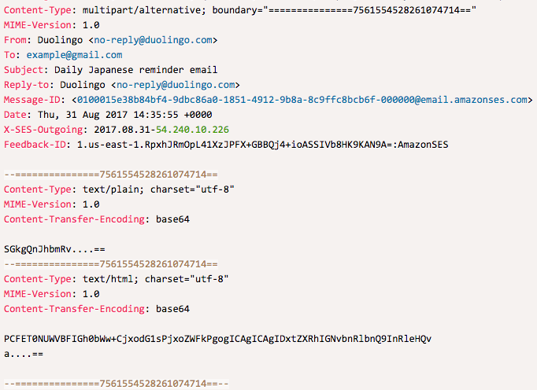

# prismjs-email
A prism.js language definition for syntax highlighting of raw email messages

Currently highlights:
* Headers
* X-Headers
* IPv4 and IPv6 addresses
* MIME Boundaries
* Email address
* Domains

I put this together quickly and there's likely to be a bug or three.

Header list was copied from https://github.com/13Cubed/EmailHeader.
